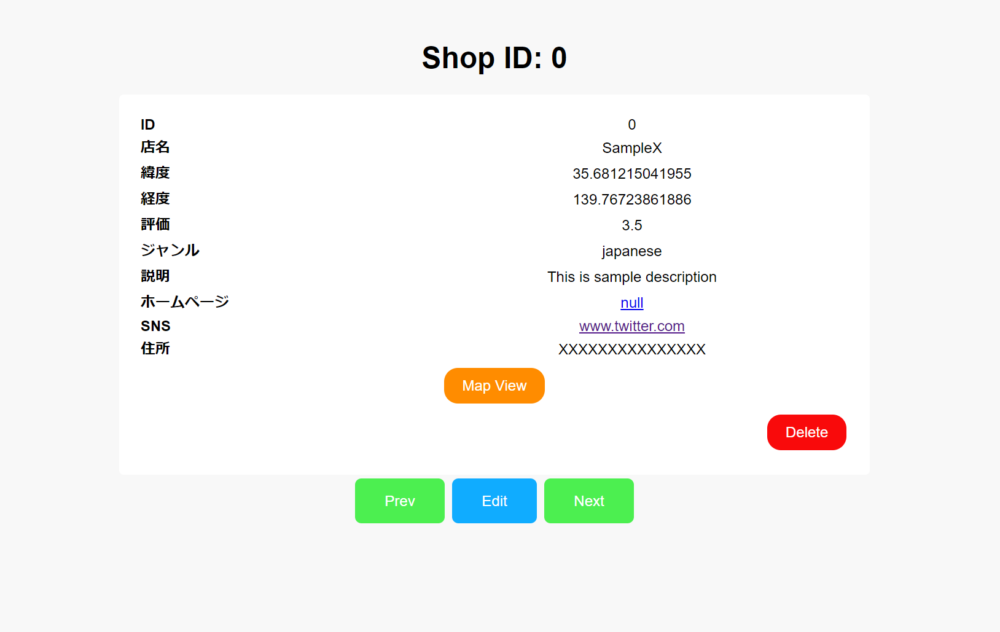

# Shop Info Editor

## Overview
Shop Info Editor is a web application that enables users to view and manage information about various shops stored in a JSON file. The application provides a user-friendly interface to add new shops and delete existing ones, ensuring a seamless user experience.

## Features
- **View Shop Information**: Display detailed information about each shop.
- **Add New Shops**: Users can input details about a new shop and add it to the database.
- **Delete Shops**: Allows users to delete shop information from the database.
- **Navigation**: Navigate through different shops and view their details.

## Usage

### View Shop Information
1. Open the web application and observe the information about the default shop displayed on the page.
2. Navigate through different shops using the "Next" and "Previous" buttons.

### Add a New Shop
1. Click the "Edit" button.
2. Fill in the details about the new shop in the provided form.
3. Submit the form to add the shop information to the database.

### Delete a Shop
1. Navigate to the shop you wish to delete.
2. Click the "Delete" button.

### Map View

1. While viewing the information of a specific shop, click the "Map View" button.
2. You will be redirected to Google Maps, showcasing the location of the shop based on its latitude and longitude.

## Setup
### Prerequisites
- PHP 7.0 or higher
- Web Server (e.g., Apache)
- Web Browser

### Installation
1. Clone the repository or download the source code.
2. Place the downloaded files in the root directory of your web server.
3. Access the application through your web browser by navigating to `http://your-server-address/index.php`.

## Technologies Used
- PHP
- JavaScript
- HTML
- CSS

## Contributing
Contributions, issues, and feature requests are welcome. Feel free to open an issue if you encounter any problems or have suggestions for improvements.

## License
This project is licensed under the Apache License 2.0. - see the [LICENSE](./../LICENSE) file for details.
